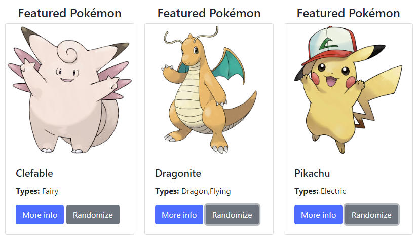

# COMPSCI 719 Assignment One &ndash; Bootstrap and AJAX
This assignment has several tasks, which together will see you develop a website from scratch.

The first two tasks have you build the layout and some content for a website, using a CSS framework - an alternative to writing manual CSS. We have not discussed CSS frameworks in this course; you are required to research and use one yourself.

The next three tasks will have you extend the website and add dynamic content, pulled from the `trex-sandwich` web server using AJAX.

The final task will be to write a short reflective report on your experiences with a CSS framework.

For this assignment, you are given some image files, and a text file containing content that should be displayed on your website. You’re also given partially-complete HTML and JS files. You likely will not need to create a CSS file for this assignment.

This assignment is graded out of 90 marks, and is worth 10% of your final grade for the course.


## Submission instructions
Your latest commit to the `main` branch of your GitHub Classroom repository for this assignment, as of the due date identified on Canvas, will serve as your submission for this assignment.


## Task One &ndash; Bootstrapping a website (30 marks)
In this question, you’ll use a CSS framework - [Bootstrap 4](https://getbootstrap.com/) - to develop a website for a popular anime / video game franchise. When you’re done, your website should be similar to the screenshot below (the page layout should be the same, but exact color schemes etc are entirely up to you) .


### About Bootstrap & CSS frameworks
Often, when developing CSS for complex websites, you may find yourself writing a lot of "boilerplate" CSS over again for each new website you create. This has been a common inhibitor of productivity in web design in the past. One solution to this problem is for a developer to package their boilerplate CSS into a library or framework which they may share between different websites. This both reduces the need to create new CSS, and provides a consistent look & feel across sites.

Sometimes, developers may decide to publish their CSS frameworks so that other developers may take advantage of their features. One such publically available framework is Bootstrap. Originally developed by Twitter to provide consistency between their in-house tools, Bootstrap is now extremely popular with web developers, and is currently the [third most popular project on GitHub](https://github.com/twbs/bootstrap).

Bootstrap has been designed such that the layout of a website is driven by CSS classes added to HTML elements, rather than writing significant amounts of CSS code. Web developers may then customize the base design using their own CSS if desired.

Bootstrap can be applied to your website using publicly available `<link>` and `<script>` tags, and contains an extensive list of components, along with its own responsive grid system for page layout. Browsing the Bootstrap documentation to find components to include on your website can often be far easier and quicker compared with writing the CSS - and sometimes JavaScript - yourself.

For this task, you'll be writing your HTML in [`site/website.html`](./site/website.html). The provided file currently has the necessary Bootstrap 4 `<style>` and `<script>` tags included, but has an empty `<body>`, which you'll be filling. You will find all required images in the images folder, and the text and table content in the [`spec/content.txt`](./spec/content.txt) file.

The screenshot below is identical to the one on the previous page, but has been annotated with the names of some Bootstrap components to help you get started. A website specification is given below. Remember to make use of the [Bootstrap 4 documentation](https://getbootstrap.com/) and / or the [W3Schools Bootstrap 4 tutorials](https://www.w3schools.com/bootstrap4/) - they're an excellent resource for this task!

**Important:** When looking up online Bootstrap tutorials, *make sure you look at Bootstrap **4** tutorials* as opposed to any other version. Different versions of Bootstrap are incompatible with one another.


### Specification
Using a combination of HTML elements and Bootstrap 4 classes, create a website which appears similar to the given screenshot (you don't need to be 100% accurate). You should not need to write any CSS. The required features are as follows:

1. **Jumbotron** *(4 marks)*: A full-width jumbotron with the provided [`pokemon.png`](./site/images/pokemon.png) image centered inside. Ideally, the jumbotron's padding will be less than default to provide an effect similar to the screenshot, and its bottom margin should be removed. These effects can be achieved using appropriate Bootstrap utility classes.

2. **Navbar** *(6 marks)*: A full-width navbar with four buttons: *"Home"*, *"TV Show"*, *"Game Mechanics"*, and *"Official Website"*. The "Game Mechanics" button should appear `active`. The only button which needs to do anything when clicked is the "Official Website" button - the user should be sent to <https://www.pokemon.com> when this is clicked.

3. **Main content** *(5 marks)*: A fixed-width container with one row and three columns (to be achieved using the Bootstrap grid system). The columns, as seen from the screenshot, are of unequal sizes.

4. **Side nav** *(6 marks)*: A side navigation bar with five buttons: *"Pokémon"*, *"Moves"*, *"Abilities"*, *"Items"*, and *"Types"*. The "Types" button should appear "active" as shown in the screenshot.

5. **Table** *(4 marks)*: A Bootstrap-styled striped table.

6. **Card** *(5 marks)*: A Bootstrap card, consisting of a top image ([pikachu.png](./site/content/pikachu.png)), and a card body with a header, content, and two buttons. The buttons need not do anything when clicked at this stage.


## Task Two &ndash; Responsive Bootstrap (5 marks)
For this task, ensure your page is responsive when viewed on smaller screens. An example of how your page might look is given in the following screenshot:


You will likely not need to change much, as Bootstrap is a mobile-first CSS framework which handles a significant proportion of the effort in responsive design for you. You may need to adjust the properties of the images and table.


## Task Three &ndash; Fetching type data (15 marks)
For this task, you will begin to remove some of the hardcoded "test" data from your website, and replace it with data loaded from an online source (i.e. the trex-sandwich web server). You may open the following link in your browser to see a list of endpoints from which you will collect data:

- <https://trex-sandwich.com/auckland-online-cs719-assignment-01>

For Task Three, begin by commenting out the data in the table - including the header row / column. Do not delete it just yet, in case you need to refer back to it later.

Now, at an appropriate location within `website.js`, add an appropriate `fetch()` call which retrieves the data from the following URL when the page loads:

- <https://trex-sandwich.com/auckland-online-cs719-assignment-01/services/pokemon/types>

This link returns an array of type objects. Each type object has the following form:

```json
{
    "name": "Fire",
    "data": ["X","X","O","","O"]
}
```

To see exactly what data is returned to you, you can open the above link in your browser.

Once you've fetched the data, populate the table with the information received from the server. When you're complete, the resulting table should contain identical information to the hardcoded table seen in the screenshots above.

When implementing this and following tasks, note that marks are given both for functional correctness, but also code readability (e.g. good variable / function naming, good comments where necessary) and decomposition (i.e. proper use of functions). In this case, one might, for example, have one function which fetches the data, and another function which populates the table with data provided to it.

Marks awarded for this task are for:
- Functional correctness *(10 marks)*
- Decomposition *(3 marks)*
- Code readability *(2 marks)*


## Task Four &ndash; Random Encounters (10 marks)
For this task, we will add the ability to display a random *"featured Pokémon"*, rather than our currently-hardcoded Pikachu.

To do this, add appropriate code to website.js which fetches information from the following URL:

- <https://trex-sandwich.com/auckland-online-cs719-assignment-01/services/pokemon/summary/random>

Every time that URL is visited, information about a random Pokémon will be retrieved. Examine the JSON returned in your browser to see its structure.

Your code for Task Three should, after retrieving the data, replace the data already in the right-hand Card view with the new data. A random Pokémon should be displayed when the page first loads, and should change when the user clicks the "Randomize" button.

Some possibilities which might be retrieved from the service are shown here:



Marks in this task are awarded for:
- Functional correctness *(8 marks)*
- Decomposition *(1 mark)*
- Code readability *(1 mark)*


## Task Five &ndash; Modals (15 marks)
For this task, we will make use of one of Bootstrap’s more advanced features - the modal - and get more AJAX practice.

A modal is essentially a popup dialog box - but one which adopts the look & feel of your website and can contain any content you choose (as opposed to the `alert()` dialog which you can invoke using JavaScript, which looks ugly, is intrusive, and can only contain text).

Initially, using the Bootstrap documentation, investigate Bootstrap modals and add one to the page. For testing purposes, have it contain a header, an image, two paragraphs, and a close button, as can be seen in the below screenshot. Have the modal open when the "More info" button (in the "Featured Pokémon" card) is clicked.

Once your modal is functioning as expected, add additional JavaScript code to website.js as follows. Once your fetch call from Task Four completes, begin another fetch to the following URL:

- <https://trex-sandwich.com/auckland-online-cs719-assignment-01/services/pokemon/detail/:id>

Where **:id** is equal to the fetched Pokémon's `id`. This endpoint will return a more detailed description of the Pokémon (again, you may check out the [specification](https://trex-sandwich.com/auckland-online-cs719-assignment-01) for an example of what data is returned).

Then, once the new data is fetched, use it to populate the contents of your newly created modal.

Essentially, when complete, the user will be able to click the "More info" button, and see a popup dialog containing a more detailed description of the same featured Pokémon.


This task will be marked accordingly:
- Modal displays correctly *(10 marks)*
- Modal is dynamically populated with data from the server *(5 marks)*


## Task Six &ndash; Report (15 marks)
For your final task, write a short report of no more than two pages. In your report, focus on the following topics:

1. What were your experiences using Bootstrap? How effective is the documentation, and other aids? Is there anything that was easier than you expected? Harder?

2. Compare and contrast Bootstrap with writing your own CSS. What are the benefits and drawbacks of each approach?

Make sure to include your report (as a **PDF** file) in this repository as part of your submission.
